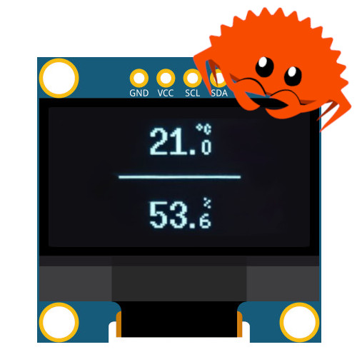

# Galvy



## Description

Galvy (from [galvanization](https://en.wikipedia.org/wiki/Galvanization): the process used to prevent rust) is a DIY project with the purpose of reading and displaying air temperature and humidity.

Oh, and it's written in Rust!

---

## Supported Hardware

### Platform

  - ESP32

### Display

  - OLED 128x64 ssd1306

### Temperature/Humidity sensor: 

  - DHT22

## Schema


---

## Development 

### Installing Rust for Espressif SoCs

https://esp-rs.github.io/book/installation/installation.html

### Run

```cargo run```
